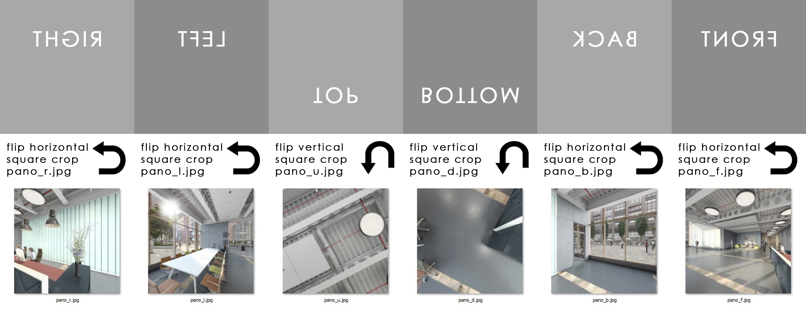

# Cubemap-maker
A Photoshop script which given source images builds a VR cubemap strip

A Cubemap is a collection of six square textures that represent the reflections on an environment. The six squares form the faces of an imaginary cube that surrounds an object; each face represents the view along the directions of the world axes (up, down, left, right, forward and back).

The stereoscopic Cubemaps have two collections of six squares, for the left and the right eye respectively. 
This script creates monoscopic Cubemap which is a collection of six squares.

We have a group of six JPEG images in a folder. The script is given the path to this folder. It processes the images flipping them horizontally or vertically as needed and concats them in a strip.

The result is saved in the source folder.

The JPEG images names must have the same base name with **_r**, **_l**, **_u**, **_d**, **_b** and **_f** suffixes for the **right**, **left**, **up**, **down**, **back** and **front** squares respectively.

The result is a JPEG image whose name is the base name with **_cubemap** suffix.

# To run the script:
 - Double click it
or
 - Right-click > Open with Photoshop
or
 - In Photoshop select File > Scripts > Browse. Find and select the script. Click Load.

# Installation:
 1. Place "Cubemap Maker.jsx" or its alias(Mac) or shortcut(Windows) in --Photoshop Directory--/presets/scripts/

 2. Restart Photoshop

 3. Select File -> Scripts -> Cubemap Maker

 Optional: Set a keyboard shortcut or record an action for faster access.
